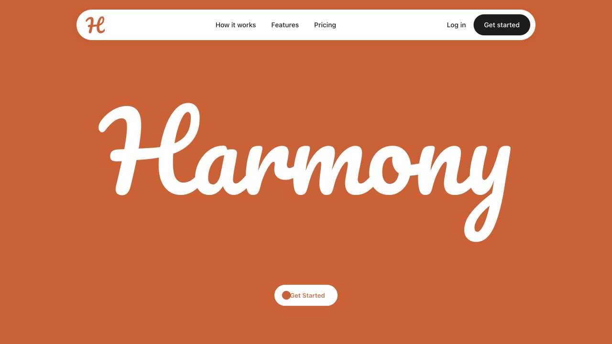
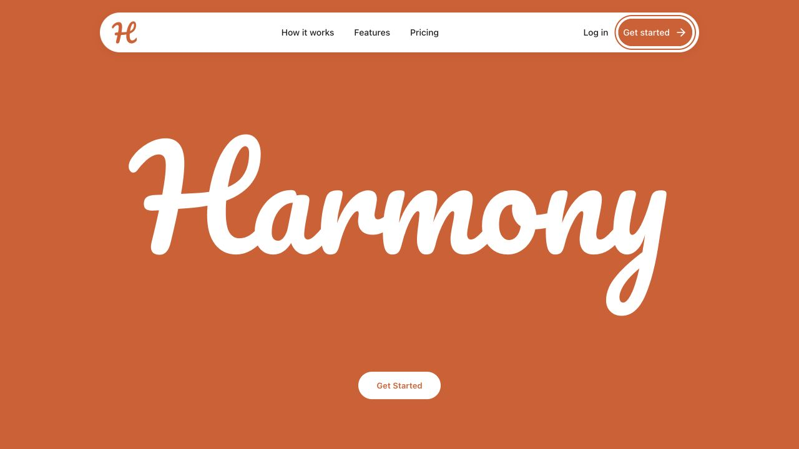

# Harmony: approved design philosophy

This is the permanent design reference for Harmony. Connor explicitly approved the completed direction on 1 October 2026 as exactly the branding and design language he wants. Read this complete file before every design task and compare the rendered result against it afterwards.

It records his feedback and the actual approved implementation through commit `dc55cc9`. Exact values describe the current baseline, not speculative future designs. Explicit current user instructions take precedence. When a lasting change is accepted, update this reference alongside the implementation, keeping one maintained source rather than competing brand guides.

## Overview

Harmony is the new identity for the review assistant used by local businesses in Scotland and the UK. This document replaces the previous AURA design direction.

The typography direction is the supplied Pacifico Regular font, using ncdai's Apple Hello Effect from 21st.dev as the animation reference. The first branding screen has one job: introduce the new visual direction. It contains a flat orange background, a centred white, naturally connected “Harmony”, the subsequently requested floating navigation at the top, and a Get Started call to action beneath the word.

This is a brand hero on `/`. The existing authentication and dashboard routes retain their working behaviour and await a separate Harmony design brief. Their previous styling is not a reference for future Harmony work.

### Design philosophy

Harmony should feel as considered and restrained as an Apple interface: simple composition, precise spacing, clear controls and fluid motion. Its own identity comes from burnt copper/orange, pure white and the naturally connected Pacifico wordmark. Do not copy Apple's branding or replace Harmony's personality with a generic software template.

The signature moment is the white name writing itself onto an orange field, followed by scrolling through the actual lettering into white. Everything around that moment stays quiet. The floating navbar and compact CTAs support the experience without competing with it. Create a polished, confident and calm impression through proportion, space, typography and consistent behaviour, rather than decorative effects or persuasive filler.

### Approved scope

### Application reset approved on 2 October 2026

All AURA-era application design is retired. Authentication, onboarding and the dashboard should be designed afresh for Harmony, including navigation, page composition, form presentation, step grouping, customer-facing copy and the overall customer journey. The existing app is a source of functional evidence, not a visual or interaction template to recolour.

Retain what the product needs to collect, validate and save, its permissions and consent requirements, and the meaning and consequences of its actions. [APP_BEHAVIOUR.md](./APP_BEHAVIOUR.md) records the current form and workflow evidence for that purpose. Existing step order and UI mechanisms are not automatically binding; redesign them deliberately while preserving the necessary dependencies and outcomes. Current implementation bugs are not part of the intended contract.

The approved Harmony landing and branding remain the design reference. The new app's detailed flow, layouts and component system are not yet specified. This reset does not authorise deleting working functionality, changing provider credentials, or replacing backend contracts as an incidental design change.

The approved visual baseline is the public landing page at `/`. Future marketing, onboarding and product work should inherit this identity. The old authentication and dashboard styling is not the Harmony visual reference. Preserve useful existing behaviour when giving those screens the new visual treatment.

A marketing hero can be spacious and expressive; a dashboard still needs readable information, clear states and efficient tasks. Use the same palette, utility typography, restraint and maintained control behaviour. Do not repeat the writing animation throughout ordinary product screens. Detailed dashboard grids, form layouts, chart palettes, error colours and additional component variants are not yet approved. Treat new proposals as extensions of the baseline, not existing brand rules.

### Approved visual examples

Final smaller wordmark, centred independently of the lower no-dot CTA:

Navbar interaction state. This capture uses keyboard focus, which shares the hover animation; the extra outline is the focus indicator:

## Colors

Burnt orange `#DB5926` fills the opening viewport. White `#FFFFFF` colours the wordmark and becomes the full page background after scrolling through the word. The white navbar uses `#1D1D1F` for readable labels and its primary action, with the supplied orange H logo. Its Get started action retains a dark resting background and white text, switching to orange with white text on hover. The hero has no gradients or textures.

Runtime tokens live in `src/pages/Landing.css`: `--harmony-orange`, `--harmony-white`, `--harmony-ink`, `--harmony-utility-font`, `--harmony-page-gutter`, `--harmony-hello-width`, `--harmony-action-frame-width`, `--harmony-cta-gap` and `--harmony-display-font`. This document mirrors those values. The body background uses the same orange to cover overscroll outside the page.

### Exact colour roles and component states

| Role | Value | Application |
|---|---|---|
| Burnt copper/orange | `#DB5926` | Opening field, brand identity, hero CTA label, both CTA hover fills |
| Pure white | `#FFFFFF` | Wordmark, navbar surface, hero button surface, hover labels, scroll destination |
| Utility ink | `#1D1D1F` | Navbar labels, Log in and resting navbar button |

Use the exact orange. Do not shift it towards red, brown, peach or pale terracotta. White stays pure white, not cream or beige. Utility ink is a functional neutral, not a second brand accent.

| Element | Resting background | Resting text | Hover/focus background | Hover/focus text |
|---|---|---|---|---|
| Hero Get Started | White | Orange | Orange with white border | White plus arrow |
| Navbar Get started | Utility ink | White | Orange | White plus arrow |
| Navbar surface | White | Utility ink | White | Utility ink |

Both button resting treatments are deliberate. Reuse the animation without conflating the variants. The wordmark itself has no button-like hover treatment. Use dark utility text where ordinary content needs clarity on white. A decorative colour is not automatically suitable for long text or error messages.

Supporting values below provide restrained separation, not extra brand colours:

| Detail | Approved value |
|---|---|
| Navbar/panel border | `1px solid rgba(29, 29, 31, 0.06)` |
| Navbar shadow | `0 3px 12px rgba(44, 23, 14, 0.08)` |
| Mobile panel shadow | `0 8px 24px rgba(44, 23, 14, 0.1)` |
| Hero CTA border | `1px solid #FFFFFF` |
| Hero keyboard focus | 2px white outline, 5px offset |
| Navbar keyboard focus | 2px orange outline, 4px offset |

## Typography

Pacifico Regular is the brand display font. The wordmark uses contours exported from the supplied TTF with native font spacing and natural connections, without added connector lines. The contours retain the supplied letter shapes and inherit white through `currentColor`. The font is unmodified and self-hosted in `public/fonts/`, with its face declared in `src/pages/Landing.css`. Its SIL Open Font Licence is retained alongside it.

`src/components/ui/harmony-pacifico-paths.js` owns the wordmark contours and invisible pen guides. The navbar uses system sans-serif typography at 14px, keeping utility labels distinct from the Pacifico brand lettering.

### Type roles and exact utility styles

| Role | Font | Size | Weight | Line height |
|---|---|---|---|---|
| Harmony identity | Supplied Pacifico Regular contours | Proportional SVG size | Original Regular shapes | Native 824:294 artwork ratio |
| Desktop navbar and navbar CTA | System sans-serif | 14px | 500 | 1.4 |
| Mobile navbar CTA | System sans-serif | 13px | 500 | 1.4 |
| Hero CTA | System sans-serif | 13px | 600 | 1.4 |

The utility stack is `-apple-system, BlinkMacSystemFont, 'Segoe UI', sans-serif`. Labels use natural spacing, with no wide tracking, all-caps styling or oversized bold text. Future body/heading sizes should serve readability and hierarchy; they have not yet been individually locked in.

Pacifico is the brand/display voice, used with restraint. Do not use it for navigation, buttons, forms, paragraphs or dense dashboard data. Do not substitute Tiempos Headline, a generic serif, another script or artificial handwriting for the wordmark. Earlier Tiempos/serif work was superseded by the supplied Pacifico; old font assets are not evidence of approval.

### Assets and licences

| Asset | Canonical location |
|---|---|
| Supplied orange H monogram | `public/brand/harmony-logo.png` |
| Supplied Pacifico font | `public/fonts/Pacifico-Regular.ttf` |
| Font licence | `public/fonts/Pacifico-OFL.txt` |
| Word contours and pen guides | `src/components/ui/harmony-pacifico-paths.js` |
| Writing reference licence | `src/components/ui/LICENSE.ncdai.txt` |
| Hover button reference licence | `src/components/ui/LICENSE.magicui.txt` |

The logo and font stay unmodified. CSS frames transparent logo padding, without redrawing the H. Retain the licence files when reusing assets.

## Layout

Fill the viewport and centre the name vertically and horizontally. The SVG scales down with the viewport, retains its 824:294 aspect ratio and has a maximum artwork width of 900px, reduced by 10% from the previous navbar-spanning size for a lighter composition. The artwork stays centred independently of the CTA. A height-based cap leaves room for the navbar and button on short screens. Keep 24px of edge clearance on small screens. Use the small viewport height so mobile browser controls do not obscure the name. A stable 100lvh stage covers the full screen even when mobile browser toolbars collapse. The word and CTA remain positioned within the original 100svh composition so toolbar changes do not move them. The portal height is calc(100lvh + 240svh), giving 240svh of native scroll travel. Below 768px, calc(100lvh + 144svh) retains 40% less scrolling than the original 240svh mobile zoom. A blank 100lvh white section follows. Reduced motion uses an ordinary 100lvh orange section.

### Composition rules

Centre the word horizontally and vertically in the viewport, independently of the button. Do not centre the combined word-and-button stack, which would move the word upwards. Keep the CTA smaller and clearly lower down.

The final maximum word frame is **900px**. The earlier 1000px version felt clunky and was reduced by 10%; the original 638px size is also superseded. Do not revert to either earlier proportion as the default.

The 1000px CTA frame is an invisible positioning reference, not visible oversized lettering. It intentionally holds the button in the approved lower position after the word becomes smaller.

| Geometry | Approved value |
|---|---|
| Word maximum | 900px |
| Word aspect ratio | 824 / 294 |
| Stage edge clearance | 24px |
| Short-screen word/frame width cap | `calc((100svh - 240px) * 824 / 294)` |
| Desktop navbar width | `min(calc(100% - 48px), 960px)` |
| Desktop navbar top | `max(20px, env(safe-area-inset-top))` |
| Navbar minimum bar height | 64px |
| Mobile breakpoint | Below 768px |
| Mobile navbar width | `calc(100% - 32px)` |
| Mobile navbar top | `max(16px, env(safe-area-inset-top))` |
| CTA positioning frame maximum | 1000px |
| Gap below CTA positioning frame | `clamp(48px, 8svh, 72px)` |

At the reference 1280 × 720 viewport, the word frame is 900px wide, centred at x = 640; the navbar is 960px wide; the hero CTA is approximately 132 × 44px with its top near y = 596. These are calibration measurements, not hard-coded screen coordinates.

Scale the artwork proportionally on mobile. Use safe-area insets and small viewport units. Keep the navbar, word and CTA separated on short landscape screens. No horizontal overflow or clipped arrow. Keep the current 44px control height for touch interaction.

The opening contains only the navbar, wordmark and hero CTA. Keep the rest of the orange field empty. Taglines, paragraphs, badges, testimonials, statistics, scroll hints, pickers, imagery and further CTAs need a subsequent brief.

## Elevation & Depth

The hero stays flat. The floating navbar adds a restrained border and shadow to remain visible over both orange and white. Its mobile disclosure uses the same opaque white surface; no glass effects.

## Shapes

Keep the supplied Pacifico curves and naturally joined letter shapes. The navbar and primary action use pill corners; the mobile panel uses a 24px radius.

### Applying the shape language

The invisible logo frame uses an 8px radius without changing the artwork. Keep the soft Pacifico curves balanced by quiet utility type. Do not add connector lines to the word or infer a universal rounded-card system from the navbar alone. New product surfaces need a considered application of the same restrained direction.

## Components

### Apple hello

`src/components/ui/apple-hello-effect.jsx` preserves the author's two-stroke sequence, accelerated with a 0.65 duration scale and a gentle, near-linear cubic easing curve `[0.25, 0.1, 0.75, 0.9]` for more continuous writing. The first stroke takes 0.52 seconds; the second starts at 0.455 seconds and takes 1.82 seconds. Each guide switches to full opacity immediately when its drawing starts, without a fade. The name finishes in about 2.3 seconds and remains visible. Two animated pen guides reveal the genuine Pacifico contours through an SVG mask, adapting the reference's fixed hello geometry to the requested font and name. Undrawn guides are hidden, preventing premature starting dots. Reduced-motion settings show the finished word immediately.

Source: https://github.com/ncdai/chanhdai.com/blob/main/src/registry/components/apple-hello-effect/apple-hello-effect-english.tsx

The original MIT licence is retained in `src/components/ui/LICENSE.ncdai.txt`.

The starting H must not fade in. Pen guides stay hidden before drawing, then appear at full opacity as their stroke begins. Do not show a dotted skeleton or visible starting points. The rejected crossbar change was reverted; retain the restored pen paths and sequence. Do not rewrite the reveal as an incidental layout fix.

### Scroll portal

`src/components/ui/glyph-portal.jsx` owns the scroll-only wrapper, inspired by the visible Glyph Portal reference at https://21st.dev/@Legacy/components/glyph-portal. The reference source requires sign-in and has not been copied or installed. No picker, annotations, buttons, hints or demo copy are included.

Native scroll drives exponential scale through a short, damped spring, without capturing wheel or touch input. This interpolates between mobile scroll updates instead of stepping the camera directly with each event. Spring settings are stiffness 600, damping 40, mass 0.6, restDelta 0.0001 and restSpeed 0.001. Progress tracks the portal from start/start to end/start, then normalises against its measured height minus the sticky stage height. This keeps the zoom aligned with the actual sticky release rather than Safari's changing visible viewport. Both heights are observed on resize, without per-frame layout reads. Progress is clamped to 0–1 and snaps to the native start/end boundaries so the orange stage cannot lag behind the following white section. The camera moves into a solid point of the existing Pacifico stroke (403, 133 in its 824 by 294 artwork coordinates). Responsive geometry sizes the final zoom so white ink covers all viewport corners. No colour fade or overlay creates the white finish. Scrolling back reverses the zoom without replaying the greeting.

After the writing callback finishes, the wrapper removes its now redundant SVG mask through CSS, leaving identical font contours. This prevents mask caching artefacts during large zooms or viewport resizing, without modifying the lettering component or its animation timing. Reduced motion uses two ordinary viewport sections, orange then white, without zooming.

For mobile rendering performance, the finished lettering is redrawn from the same Pacifico vector path onto a canvas bounded to the sticky viewport during zoom. The original SVG still owns the complete writing animation and remains the accessible Harmony image. At zero scroll it is visible again, with no replay. The canvas is hidden from assistive technology and cannot receive pointer input. The original SVG also provides a fallback when Canvas 2D or Path2D is unavailable. No scaled bitmap, GPU-promoted giant SVG, changed letter shape or cached low-resolution zoom is used.

Canvas resolution tracks the device pixel ratio up to 2× to bound memory, and vector contours are redrawn at the current scale on each animated progress update. Dimensions and geometry are measured only on resize, not inside the animation loop. When every viewport corner is inside the known solid ink radius, a solid fill is the equivalent final rendering. The loop stops when progress stops changing. Painting is contained within the stage. The CTA shares the smoothed camera progress and retains its original first-6% fade/hide rule.

### Navbar

`src/components/ui/navbar-1.jsx` and `navbar-1.css` own the fixed floating white pill, adapting the visible reference at https://21st.dev/@preetsuthar17/components/navbar-1. The reference source requires sign-in and has not been copied or installed. The supplied logo is unmodified in `public/brand/harmony-logo.png`; CSS frames the transparent padding without changing its artwork.

The selected labels are How it works, Features and Pricing. These remain static preview labels until genuine page destinations exist. Log in links to `/login`, Get started to `/signup`, and the H logo returns to the top of `/` without replaying the writing animation. Below 768px the labels and Log in move into an animated disclosure, with a 44px menu toggle. Escape closes it and returns focus to the toggle; outside pointer input and switching to desktop also close it. Reduced motion removes the disclosure animation. All clickable controls have a visible keyboard focus outline.

#### Navbar dimensions and behaviour

| Detail | Approved value |
|---|---|
| Desktop bar padding | `8px 10px 8px 18px` |
| Desktop bar gap | 24px |
| Main label gap | 32px |
| Right action gap | 16px |
| Logo frame / source display | 40 × 40px / 68 × 68px, centred to account for transparent padding |
| Mobile left padding / bar gap | 14px / 12px |
| Mobile action gap | 4px |
| Menu toggle / icon | 44 × 44px / Lucide Menu or X at 20px |
| Disclosure gap below bar | 10px |
| Disclosure padding | `14px 24px 20px` |
| Disclosure entry/exit | 0.18 seconds, ease-out, 8px vertical movement with opacity |

The navbar stays fixed and legible over both orange and white. Keep the mobile disclosure behaviour and accessible labels, not just its appearance. Reuse Lucide for meaningful action icons rather than introducing decorative icon styles.

### Interactive hover button

`src/components/ui/interactive-hover-button.jsx` and its scoped CSS adapt the public manual source at https://magicui.design/docs/components/interactive-hover-button, linked by the requested 21st component. The JSX supports router links for navigation and native buttons for form submission/actions, with a single accessible name. The resting label is centred without a dot. An initially hidden orange fill expands over 300ms while the first label exits and a white label with arrow enters. A 132px minimum width preserves the compact button size. Keyboard focus uses the same state with a visible outline. Reduced motion switches states immediately. The hero standard colours are white with orange lettering; hover colours are orange with white lettering and a white border. Navbar1 reuses this same component and animation for its Get started action, retaining its original dark resting background, white text, 44px height and navigation typography. Its hover fill is orange with white text and the same incoming arrow.

The compact call to action has a 44px minimum height, 13px text and 20px side padding. Its positioning uses the previous 1000px artwork frame and a 48–72px gap that scales with viewport height, keeping the button in place when the word is reduced. The word remains centred independently of the button. A separate portal slot fades it out during the first 6% of scroll travel and hides it from interaction afterwards, so the zoom continues into uninterrupted white. Reduced motion keeps it visible on the ordinary orange section.

#### Button variants and exact motion

| Detail | Hero variant | Navbar variant |
|---|---|---|
| Label casing | Get Started | Get started |
| Minimum height | 44px | 44px |
| Minimum width | 132px | Content-sized to preserve original navbar proportion |
| Padding | `8px 20px` | `0 22px` desktop; `0 18px` mobile |
| Type | 13px / 600 | 14px / 500 desktop; 13px / 500 mobile |
| Resting background / label | White / orange | Utility ink / white |
| Border | 1px white | None |
| Interaction fill / label | Orange / white with arrow | Orange / white with arrow |

Shared mechanics:

- All transitions use 300ms with CSS `ease`.
- Fill is a pseudo-element clipped from `circle(0% at 24px 50%)` to `circle(150% at 24px 50%)`. No visible circle or dot in the resting state.
- The complete resting row, including any leading provider icon, exits 48px to the right and becomes transparent together. This keeps the Google mark from remaining behind the incoming hover label. Disabled buttons restore the complete resting row.
- Incoming white label/arrow enters from 48px to the right and ends centred at translateX(0).
- Lucide ArrowRight is 20px, with an 8px label gap.
- Button dimensions stay stable through the interaction.
- Keyboard focus shares the interaction state and adds a visible outline.
- Reduced motion switches states immediately.
- Each link has one accessible name; duplicated visual labels are hidden from assistive technology.

Both CTAs use InteractiveHoverButton. Do not maintain separate animation implementations. The hero CTA fades out during the first 6% of portal progress, then becomes hidden and unavailable for interaction; reversing scroll restores it. Reduced motion keeps it visible in the normal orange section.

### Authentication brief, 2 October 2026

The requested reference is [appvibed01’s Auth Switch](https://21st.dev/@appvibed01/components/auth-switch). `/login` and `/signup` share `src/components/ui/auth-switch.jsx` and its scoped stylesheet. The component source supplied by Connor as a PDF on 2 October now establishes the circular sweep and delayed panel/form motion. The registry still requires authentication, so the source is integrated directly into the maintained Harmony adaptation rather than installed by the CLI. Browser verification is pending because the browser access-policy check was unavailable during implementation.

The requested extension uses flat Harmony orange and pure white, without the reference’s purple gradient, emojis or unsupported social providers. Pacifico is limited to the static Harmony identity; headings, fields, help and actions use the system utility stack. The auth Harmony wordmark has no hover underline; it remains a home link with a visible keyboard focus outline. Login retains email/password, password visibility, recovery and Google sign-in. Signup starts with company name and Next, then continues to the existing Google account signup. The account step greets the entered company with “Hi [company name],” followed by “Let’s create your account.” Long company names wrap within the form width.

All auth primary actions, mode-switch actions and Google actions reuse InteractiveHoverButton: white/orange at rest, orange/white with an incoming arrow on hover or keyboard focus, no dot, pill radius, 44px minimum height, 13px/600 text and the same 300ms animation. On the white form surface the border and focus outline use the existing orange token; on the orange panel the border and focus outline remain white. Google’s genuine provider mark identifies the action and is not an additional Harmony brand colour. Pending actions are disabled, with stable full-width form buttons and an accessible busy state.

Connor’s full-screen reference on 2 October supersedes the initial inset card: auth fills the full screen edge to edge, with no outer gutters, maximum panel width, border or rounded outer corners. The desktop surface and form have a 100svh minimum height; content can grow naturally on short screens. Form content remains at most 330px wide. The desktop identity scales from 42px to 80px with viewport width and sits 48–160px from the top, with the welcome copy offset 32–64px below the panel centre to match the supplied reference. Desktop mode switching uses the supplied source’s timings: a 1.8-second ease-in-out curved panel sweep, 0.9-second welcome movement after a 0.6-second delay, and 1-second form movement after a 0.7-second delay. The orange sweep is above the form, with pointer events disabled. Each welcome panel stays on its own side and clips its outgoing/incoming content, instead of moving a shared welcome panel through the form. The inactive welcome panel is inert, hidden from assistive technology and cannot intercept pointer input. Below 768px only the active welcome panel takes up space. These layering and clipping rules prevent overlap in both switch directions while keeping the same settled composition and timings. Below 768px the orange introduction has a 308px minimum height and sits above the white form in natural document flow, filling the screen width and at least the full small viewport height together; neither form nor mobile keyboard is trapped in a fixed-height scroller. Form entry is a small 8px/360ms transition. Reduced motion removes transitions and reveals the final state immediately. These dimensions implement this auth brief and do not alter the approved landing geometry.

The top-left exit uses `src/components/ui/back-button.jsx` and its scoped CSS, adapted from Connor’s supplied BackButton markup. It is a real link to `/`, white with orange text and a 16px left arrow. It retains the specified 25%-to-100% expanding arrow panel and fading Back label over 500ms; keyboard focus triggers the same interaction with a visible outline, and reduced motion removes transitions. The button is a compact 112px-wide pill, at least 44px high, 24px from the top/left or the safe-area boundary. This specifically requested Back interaction is distinct from the primary CTA’s existing 300ms incoming-arrow animation. It stays top-left in both modes. The mobile brand and welcome area leave room below it.

The supplied Auth Switch source has mode-switch transitions, with no first-load animation. Connor’s requested opening reuses those motion timings: the orange circle enters from outside the viewport over 1.8 seconds, welcome content moves in from 800px after 0.6 seconds over 0.9 seconds, and the form enters from the opposite side after 0.7 seconds over 1 second. Entry uses the CSS translate property separately from mode-switch transforms, and captures the initial route once, so typing, validation, signup steps and mode changes do not replay the entrance. The circle’s entry offset is 36% of its own width, just beyond the viewport edge, in the direction appropriate to the initial route. Below 768px the stable orange introduction remains visible and the form enters from 300px below over 1 second after 0.8 seconds, adapting the source’s mobile direction and delay without changing the approved natural-flow layout. The entry phase is retired permanently after 1.8 seconds, or immediately on focus or mode switching. Focus leaving a control cannot restore the entrance animation. Keyboard focus reveals the complete screen immediately; reduced motion shows the complete screen without an entrance. This is an explicit first-load extension of the supplied effect, not an entrance already present in its original source.

Field labels stay visible, inputs are 48px high with 16px text, and errors occupy reserved space. Text errors use utility ink rather than adding an unapproved accent. Native labels, autocomplete, app-owned validation, first-error focus and password-manager paste remain supported. Switching modes clears the password; the company draft survives Back and Google’s redirect in session storage. Existing account names are preserved. See APP_BEHAVIOUR.md for completion and retry details.

### Landing page

`src/pages/Landing.jsx` owns the page composition. It composes the unchanged Harmony greeting inside the scroll portal, followed by plain white. It also mounts the fixed Navbar1 above the scroll stage and supplies the Get Started call to action to its separate portal slot. No footer, photography or additional marketing content.

### Runtime ownership

This document is the maintained design contract; the following files implement it. Update both in the same changeset when an accepted design decision changes. Prefer shared tokens and components over duplicated one-off values.

| Concern | Runtime source of truth |
|---|---|
| Brand variables, font face, word size and CTA position | `src/pages/Landing.css` |
| Word contours / pen guides | `src/components/ui/harmony-pacifico-paths.js` |
| Writing sequence and timing | `src/components/ui/apple-hello-effect.jsx` |
| Scroll zoom and CTA visibility | `src/components/ui/glyph-portal.jsx` |
| Navigation composition and mobile behaviour | `src/components/ui/navbar-1.jsx` |
| Navbar geometry, ink and elevation | `src/components/ui/navbar-1.css` |
| Shared button markup / accessible label | `src/components/ui/interactive-hover-button.jsx` |
| Shared button animation and hero dimensions | `src/components/ui/interactive-hover-button.css` |

## Do's and Don'ts

### Canonical UI Map

The product owners below identify the current implementation for functional inspection. They are not mandatory presentation primitives for the fresh Harmony app. The marketing CTA and navigation remain approved Harmony components; product form and selector presentation can be rebuilt while preserving the required data behaviour.

| Capability | Canonical owner | Source of truth | Allowed variants | Verification |
|---|---|---|---|---|
| CTA | InteractiveHoverButton | `src/components/ui/interactive-hover-button.jsx` and its scoped CSS | Hero white rest state; navbar dark rest state; shared orange hover/focus state | Signup destination, keyboard focus, mobile layout and hidden state after scrolling |
| Navigation | Navbar1 | `src/components/ui/navbar-1.jsx` and its scoped CSS | Desktop pill and mobile disclosure | Logo and auth destinations, mobile open/close, Escape focus, and 390px overflow checks |
| Select/Listbox | Native platform select | `premium-ui.json` and dashboard components | Native selection controls | Keyboard and narrow viewport checks when these controls change |
| Form | Harmony AuthSwitch for account entry; existing dashboard forms for untouched workflows | `src/components/ui/auth-switch.jsx`, dashboard routes and `src/components/BusinessSetupModal.jsx` | Login and company-first signup; existing settings and modal steps | Validation, loading, error, keyboard, mobile and success checks when forms change |
| Scrollbar | Global application stylesheet | `src/index.css` | Workspace and internally scrolling modal | Desktop and narrow viewport overflow checks |

### Brand rules

- Keep the exact orange and white brand palette, with dark utility text in the white navigation.
- Keep the first screen limited to the greeting, requested navigation and Get Started call to action.
- Preserve the Pacifico letter shapes and natural connections, and provide an accessible text equivalent.
- Honour reduced motion and keep the layout stable during animation.
- Do not carry forward the previous AURA marketing design.
- Expand the brand only when a subsequent brief calls for it.

### Feedback ledger: final decisions, not abandoned iterations

| Feedback / iteration | Rule to carry forward |
|---|---|
| Forget previous designs; new Harmony direction | Old AURA marketing is retired |
| Apple-like, sleek; burnt orange and white | Precise composition, exact palette, restraint and controlled motion |
| Initially nothing but orange and the name | Preserve the empty field; only later requested navbar and CTA are approved additions |
| Dots / connecting-the-dots appearance rejected | Continuous writing with hidden undrawn guides |
| Tiempos explored, then replaced by supplied Pacifico | Pacifico is final for the wordmark |
| More fluid and faster | Preserve roughly 2.3-second reveal and final easing |
| H fading at the beginning rejected | Immediate opacity at writing start |
| Crossbar edit felt clunky; revert requested | Retain the restored pen paths and sequence |
| Scroll into the word without changing it | Separate wrapper, genuine contours, white ink filling the screen |
| CTA lower and smaller; word centred and large | Independent word centring, compact CTA, generous lower placement |
| 1000px word felt clunky | Final 900px maximum, button position preserved |
| Remove the button dot | No visible dot on either CTA |
| Same animation on navbar CTA | Shared animation, dark resting state, orange/white interaction |
| Mobile scrolling felt jittery, especially the glyph zoom | Smooth native-scroll steps and bound zoom rendering to the viewport; retain the approved contours, writing sequence and white finish |
| Safari toolbar collapse exposed a white strip below the orange stage | Cover the full large viewport with stable 100lvh paint; retain small-viewport word/CTA positioning and measure actual sticky travel |
| Mobile zoom should require 40% less scrolling | Below 768px, use 144svh of scroll travel instead of the original 240svh; retain desktop timing and the shared smoothing. This replaces the earlier 12.5% reduction. |

### Applying the philosophy to future screens

Keep one strong visual idea per surface. On the landing page it is the writing and scroll portal; on a product screen the primary task should lead. Do not combine unrelated animated demos because they are available on 21st.dev.

Use Pacifico for identity and system sans-serif for usability. Keep controls compact, rounded and clear. Use space deliberately; do not fill every empty area. Use icons for an action or meaning, not as decoration. Let a panel exist because it groups a real task, not because every section needs a card.

Use calm, direct UK English. Prefer short labels and useful explanations. No hype, generic claims, ornamental eyebrows or implementation jargon in customer-facing screens. Preserve the approved casing of the two current CTA labels unless a later copy brief changes it.

Forms, loading, errors, empty states and keyboard interaction still need usable behaviour when given the Harmony visual treatment. Do not copy the hero's sparse composition into a dashboard at the expense of useful information. Detailed status colours and complex charts need deliberate decisions; do not infer a whole semantic palette from one orange accent.

### Avoid

- Cream/beige in place of white or a different orange hue.
- Unapproved accents, gradients, texture, noise, photography, glow or glass effects in the opening.
- Reviving earlier serif or disconnected-letter experiments.
- Heavy hero typography, oversized controls or crowding the word with content.
- Visible starting dots, initial word fades or clunky reveal revisions.
- Decorative dots on either Get started action.
- Independently implemented button timings or animations.
- Rasterised/pixelated zoom, clipped mask artefacts or replacing the portal with a colour fade.
- Scroll hijacking, replay on reversal or intrusive motion for reduced-motion users.
- Fake links on unfinished header labels.
- Treating old dashboard styles or imported component defaults as Harmony's visual standard.

### Review checklist for every design task

1. Read this complete reference and inspect the approved visual examples. Identify whether the surface is the brand opening or a functional product screen.
2. Compare the request with the final decisions, not an earlier iteration. Explicit user changes take precedence; record accepted new decisions here.
3. Locate and reuse the canonical owner. Preserve supplied assets, word contours and approved animation paths unless the task changes them.
4. Compare colours, type roles, spacing, density, shapes and motion with the baseline. Remove anything added merely to decorate.
5. Check relevant resting, hover/focus and mobile states in the browser. Verify centring, unclipped controls, visible focus and overflow where layout changes.
6. When changing the greeting/portal, verify complete writing, uninterrupted white finish, scroll reversal and reduced motion. Do not claim checks that were not run.
7. Run checks appropriate to the change. Update this reference and its runtime values together when an enduring decision changes.

### Review and reconciliation recorded on 1 October 2026

| Earlier documentation issue | Resolution |
|---|---|
| Generic metadata did not fully express approved shape/control rules | Added actual pill/panel dimensions and shared CTA states |
| Earlier word sizes and fonts could compete with final choices | Marked 900px/Pacifico as final; recorded superseded choices in the feedback ledger |
| Hero/navbar CTA variants could be conflated | Recorded different resting colours and one shared animation |
| Existing dashboard behaviour could be mistaken for approved styling | Separated current interaction owners from the Harmony visual baseline |

This review updates documentation and retains visual examples. It does not redesign product pages or change runtime behaviour. Future accepted changes should update the date/baseline and affected sections. DESIGN.md stays the canonical reference, with AGENTS.md directing future project work to consult it.
